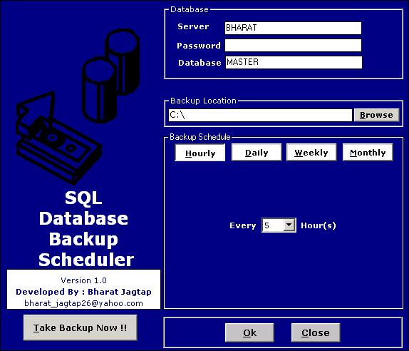



## MS Sql Database Backup and scheduler from Remote Computer\.

### Description

As MS SQL Server Dose not provide facility to take backup from Remote/client Computer

this tool provides facility of MS Sql Database Backup and scheduler from Remote[client] Computer.

USer Can create Schedule Hrly, daily, Weekly, Monthly Database backup schedule.

and need not to go on database server computer for it .

the backup directly take/schedule from client computer itself note that the backup file can be stored on client computer's specific folder
 
### More Info
 
Make Exe of the application if exe name is

1) JBServer.exe: then it will act as server and this exe should be installed /Run on Same computer where your MS sql server is Hosted

2) JBClient.exe: then it will act as Client and this exe should be installed /Run on Client computer in the network

             |
---                |---
**Submitted On**   |2005-11-11 15:48:40
**By**             |[Bharat Jagtap ](https://github.com/Planet-Source-Code/PSCIndex/blob/master/ByAuthor/bharat-jagtap.md)
**Level**          |Advanced
**User Rating**    |4.7 (28 globes from 6 users)
**Compatibility**  |VB 6\.0
**Category**       |[Complete Applications](https://github.com/Planet-Source-Code/PSCIndex/blob/master/ByCategory/complete-applications__1-27.md)
**World**          |[Visual Basic](https://github.com/Planet-Source-Code/PSCIndex/blob/master/ByWorld/visual-basic.md)
**Archive File**   |[MS\_Sql\_Dat19490811172005\.zip](https://github.com/Planet-Source-Code/bharat-jagtap-ms-sql-database-backup-and-scheduler-from-remote-computer__1-63284/archive/master.zip)

